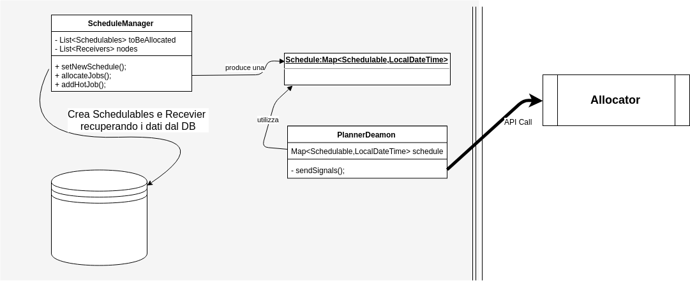

# Scheduler
---
L'applicativo java svolge il ruolo di scheduler, raccogliendo da un DB descrittori di processi e macchine virtuali per poi fornire in output uno **scheduling**, ovvero una lista di processi associati ad un tempo di start ed una macchina su cui eseguire.
Opzionalmente una volta trovata l'allocazione ottimale, fornisce un servizio *deamon* che genera chiamate API al dockerHandler ad i tempi specificati nella schedule con il comando relativo.

---
**e.g**
### Nella schedule della macchina mach1 è presente il job dummy 115 alle 17:55:34.818
```
...
, dummy241 19:19:34.821 162  
, dummy20 16:52:14.816 186  
, ...
, dummy115 17:55:34.818 327
, ...
, dummy151 18:19:34.819 827
...
```
### Quindi alle 17:55:34.818 - dockerTime


-----


## Installazione
Nell'archivio *scheduler.tar* sono inclusi :
* scheduler.jar
* install.sh

Lanciando install.sh verranno creati dei file di configurazione: apis.properties, config.properties,allocator.properties.

### apis.properties
Contiene info su le API del dockerHandler.
### config.properties
Contiene info sul database e sui path dove salvare gli output
### allocator.properties
Contiene info sul dockerHandler
```
hostname="hostname"
port=8080
#secondi di anticipo rispetto allo scheduling per far partire un docker
dockerTime=10
#secondi di anticipo rispetto allo scheduling per far partire una VM
VMTime=60
```

Configurati correttamente i file si può lanciare l'applicativo con:

```
java -jar scheduler.jar
```
Oppure per testare senza un DB :

```
java -jar scheduler.jar -t
```


## Struttura
### UML

Diagramma semplificato componenti


Sequence diagram semplificato
### Host
La classe Host serve a modellare sia un host virtuale (su cui verrano schedulati i Docker) che un host fisico,(su cui verranno schedulate le VM).
#### Attributi host
```
private int totalCPU;       //CPU TOTALI
private int totalMEM;       //RAM TOTALE
private int totalDSK;       //DISCO TOTALE
private int usedCPU;        //CPU UTILIZZATA
private int usedMEM;        //MEMORIA UTILIZZATA
private int usedDSK;        //DISCO UTILIZZATO
private boolean isSchedulable=true;//Se false lo scheduler lo ignora
                                   //e l'assegnazione dovrà essere fatta manualmente
private int expectedCPU;    //valore medio CPU atteso dati i job in coda
private int expectedRAM;    //valore medio RAM atteso dati i job in coda
private int expextedDSK;    //valore medio DISCO atteso dati i job in coda
private Receiver assignedMachine;//Macchina a cui è assegnata l'host.
private float treshold;//SOGLIA massima di utilizzo risorse
private List<Schedulable> inExecution;//Lista di Schedulable allocati sulla macchina
private Map<Schedulable,LocalDateTime> currentSchedule;//Mappa di Schedulable,StartTime allocati
public String ID;//ID dell'Host
```
#### Metodi host
checkSchedule
```
/**
 * Data una Mappa(Schedulable,StartTime) controllo che l'utilizzo delle risorse rimanga
 * sotto la soglia
 * Per ogni Schedulable controllo al tempo di start il carico sulla macchina.
 */
public boolean checkSchedule(Map<Schedulable,LocalDateTime> proposedSchedule)
```

queueJob
```
/**
 * Tenta di allocare uno Schedulable, controlla l'utilizzo delle risorse al tStart dello schedulable
 * se il controllo fallisce ritorna false.
 */
public boolean queueJob(Schedulable j)
```

jobsAtTimeT
```
/**
* Ritorna una lista di {@link Job} che sarebbero in esecuzione
al tempo t secondo la {@link Map<Job,LocalDateTime>}proposedSchedule
*/
private List<Schedulable> jobsAtTimeT (LocalDateTime t, Map<Schedulable,LocalDateTime> proposedSchedule)
```
checkLoadAtTime
```
/**
  * Data una schedule(Mappa(Schedulable,StartTime)) ed un istante di tempo t ritorna
  il carico medio(CPU+RAM+DSK)/3 sulla macchina
  * Ritorna un float tra 0.0 e 1.0 con
  il "carico" eventuale al tempo con la currentSchedule
  */
 public float checkLoadAtTime(LocalDateTime t,Map<Schedulable,LocalDateTime> proposedSchedule)
```


checkResAtTime
```
\\Ritorna un array di float con
\\l'utilizzo delle risorse al tempo t con la currentSchedule
checkResAtTime(java.time.LocalDateTime t, java.util.Map<Schedulable,java.time.LocalDateTime> proposedSchedule)

```

setStart
```
\\Permette di settare l'accensione dell'host.
setStart(java.time.LocalDateTime t)

```


### Interfacce Schedulable e Recevier
Schedulable e Recevier sono due interfacce necessarie per modellare gli oggetti che vanno rispettivamente schedulati
e quelli le cui risorse vanno ottimizzate. In altre parole:

| *Schedulable* | *Recevier*  |      |
|---------------|-------------|------|
|Docker         | VM          |I docker sono schedulati sulle VM|
|VM             | Macchina    |Le VM sono schedulate sulle le macchine|


Per questo la classe Host espone entrambe le interfacce.


## BinPacker
La classe BinPacker offre un solo metodo statico che è il cuore dello scheduling.
```
\\Dati una lista di Receiver ed un Schedulable seleziona l'Host
\\ottimale per l'esecuzione dello Schedulable
findOptimum(Schedulable toBeScheduled, java.util.List<? extends Receiver> park)
```
Quindi data una lista di Receiver ed uno schedulable
findOptimum cerca di allocare lo Schedulable nel Receiver migliore (secondo una politica che minimizza il numero di Receiver) sotto i vincoli di utilizzo delle risorse.
La soglia di carico massimo (treshold) è un attributo di ogni singolo Host, quindi dipende da ogni Receiver.

## ScheduleManager
ScheduleManager è la classe che gestisce le operazioni di inserimento degli Schedulable e dei Receiver e la conseguente allocazione.

### Metodi di ScheduleManager
Costruttore. Riceve una lista di Receiver che saranno i nodi su cui allocare gli Schedulable
```
public ScheduleManager (List<? extends Receiver> toBeManaged){
        this.nodes=toBeManaged;
    }
```
setNewSchedule
```
/**
 * Inserisce una nuova lista di elementi Schedulable e li ordina per startTime
 * @param schedule
 */
public void setNewSchedule(List<? extends Schedulable> schedule) {
    this.toBeAllocated = schedule;
    this.failedToAllocate=new ArrayList<>(schedule);
    this.allocated=new ArrayList<>();
    sortJobs();
}
```

allocateJobs
```
/**
*Scorre la lista dei Job da essere allocati e tenta di assegnarli alle macchine.
  * Se il binPacker fallisce nel restituire un nodo ottimale ,
  *allora si cambia lo startTime del processo
 *Ritorna True se e solo se tutti i Job sono stati assegnati ad una macchina.
*/
 public boolean allocateJobs(){

```
addHotJob
```
/**Aggiunge un nuovo Schedulable alla lista e lo schedula senza
*rimuovere i precedenti allocamenti.
*/
public void addHotJob(Schedulable j){
```

esempio:
```
List<Host> park;
List<Job> jobs

ScheduleManager scheduleManager = new ScheduleManager(park);

// Passo allo scheduler una lista di Jobs
scheduleManager.setNewSchedule(jobs);

// Alloco i Jobs
scheduleManager.allocateJobs();
```
### After-Scheduling Job Add
L'inserimento e la schedulazione di Jobs è possibile anche in forma parziale, ovvero è possibile schedulare un numero di Jobs per poi schedularne altri ... . Chiamando il deamon.
### Hot add
`ScheduleManager.addHotJob(Schedulable j);`
In questo caso il sistema tenta di allocare il job mantenento la schedule precendente. (Se fallisce chiama Cold-add? Cosa succede se cambio la schedule mentre è in esecuzione?)
### Cold add
In questo caso il sistema rischedula l'intero insieme di Jobs, ovvero quelli già schedulati più quello da aggiungere.

## Deamon
Il Deamon gira come thread separato dal resto.
Recupera la schedule generata dal Manager e comunica col dockerHandler tramite le apposite API.
Al momento l'unico modo con cui ciò avviene è tramite il flow esposto nel sequence diagram, ma è facilmente implementabile una soluzione dove il Deamon possa essere chiamato separatamente recuperando una schedule generata precedentemente da un DB o da un file.

```
PlannerDeamon deamon = new PlannerDeamon(); //creo il Deamon

for(Receiver m:machines){
    lg.logNodeInfo(m,"");
    m.saveSchedule();
    m.saveLoads();

    deamon.vMScan(m,m.getCurrentSchedule());
    //Aggiungo le VM con la relativa schedule
}

for(Receiver m:vmPark){
    lg.logNodeInfo(m,"");
    m.saveSchedule();
    m.saveLoads();

    deamon.dockerScan(m,m.getCurrentSchedule());
    //Aggiungo i docker con la relativa schedule
}
deam.run();
```
### dockerHandler
Componente python che svolge il ruolo di interfaccia fra il sistema e docker.
dockerHandler(server) riceve via socket dal PlannerDeamon(client) i segnali di DOCKERON,DOCKEROFF,... e chiama le API Docker corrispondenti.

[grafico UML]
